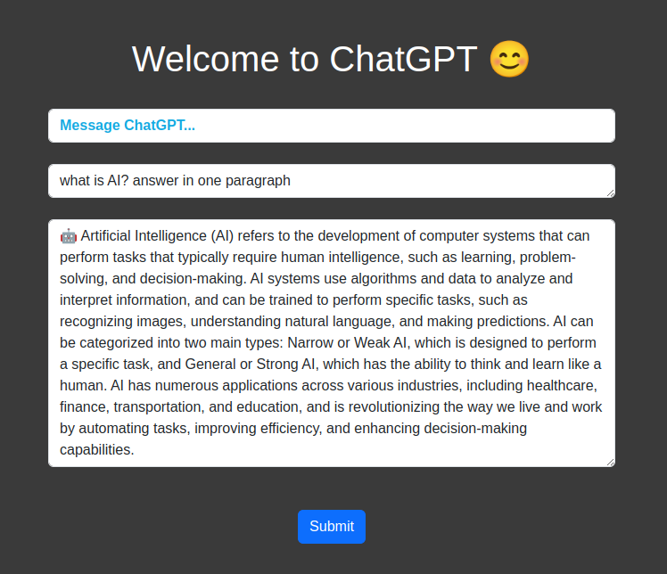

# Flask GPT App
This project is a Flask-based application that serves as an interface to a GPT model using the Groq Cloud API. The model used is **llama3-8b-8192**. The Flask app acts as a server, processing user queries, sending them to the GPT model, and returning the generated responses. Additionally, the application maintains chat history throughout the conversation.

## Results
  
<table>
<tr>
<td></td>
</tr>
</table>


## Run The Project without docker


Install packages:
```bash
  pip install -r requirements.txt 
```
Run Flask:
```bash
  flask run
```
Open your browser and acceess project through this URL: http://127.0.0.1:8080/

## Run The Project with Docker


Build the Docker image:
```bash
  docker build -t gpt-app-image 
```
Run the Docker container:
```bash
  docker run -p 8000:8000 gpt-app-container
```
Open your browser and acceess project through this URL: http://127.0.0.1:8000/
