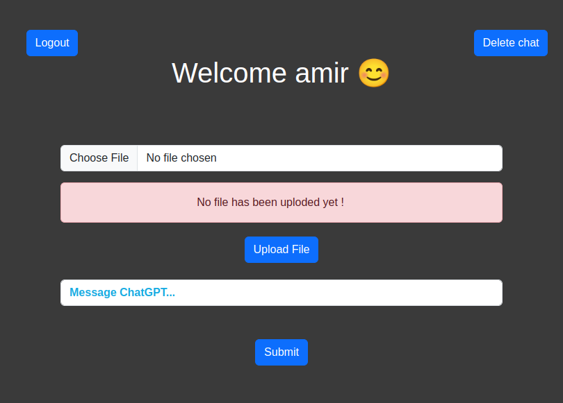
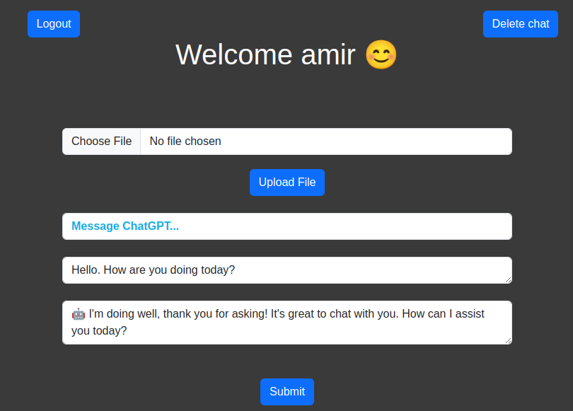

# Flask GPT App
This project integrates the GPT model with a Retrieval-Augmented Generation (RAG) feature. Users can interact with the model via a web interface, manage their chat history, and utilize advanced document querying capabilities.

Key features include:

- **User Registration and Login**: Secure user accounts with chat history recovery through MySQL database.
- **Interactive GPT Chat**: Real-time chat with the GPT model.
- **Document Upload and Querying**: Upload PDF documents and query their contents using the RAG feature.
- **Search Agents**: **Document Querying Agent (RAG)** used For queries related to the content of uploaded PDFs. **Tavily Search Agent** used For general information retrieval tasks, such as weather predictions.


##
  
<table>
<tr>
<td></td>
<td></td> 
<td></td> 
</tr>
</table>


## Run The Project without docker


Install packages:
```bash
  pip install -r requirements.txt 
```
Run Flask:
```bash
  flask run
```
Open your browser and acceess project through this URL: http://127.0.0.1:8080/

## Run The Project with Docker


Build the Docker image:
```bash
  docker build -t gpt-app-image 
```
Run the Docker container:
```bash
  docker run -p 8000:8000 gpt-app-container
```
Open your browser and acceess project through this URL: http://127.0.0.1:8000/
